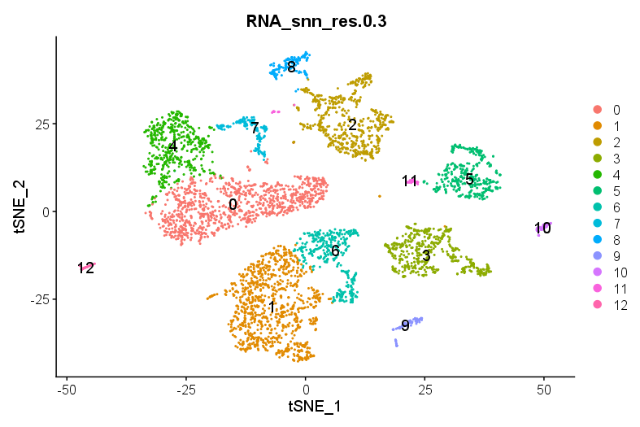

## Single cell workflow with Seurat and singleR

This is a simple workflow to integrate single cell RNA-seq data and annotating it using singleR

#### The paper used
[The link](https://cancerci.biomedcentral.com/articles/10.1186/s12935-021-02252-9)

### TSNE plot of the data

